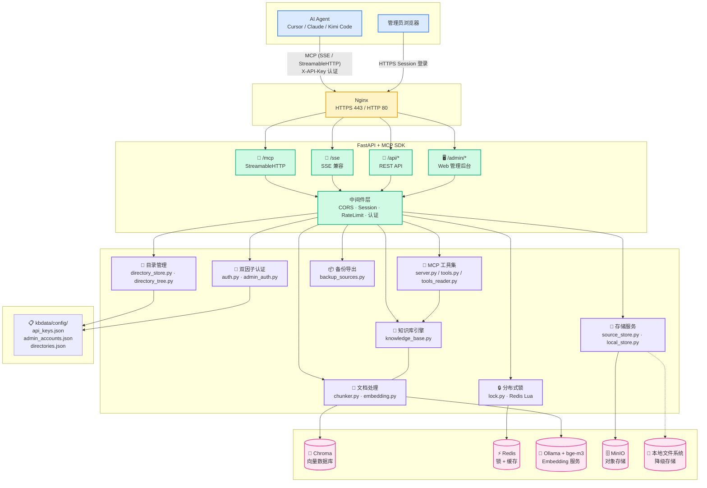
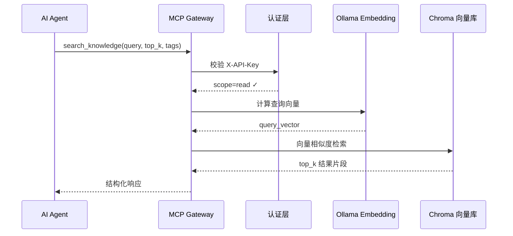
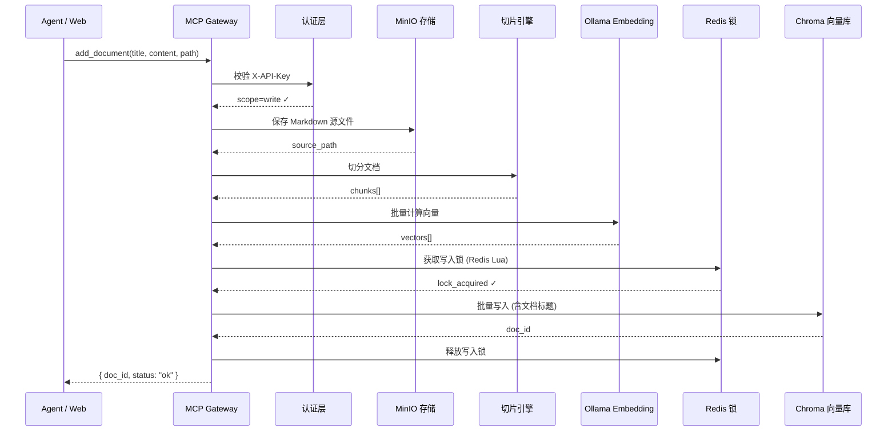

# 中央知识库 + MCP Gateway

基于 FastAPI + Chroma + Ollama 构建的中央知识库系统，通过 MCP (Model Context Protocol) Gateway 向 AI Agent 暴露检索与写入能力，配套 Web 管理后台供管理员维护知识库内容。

---

## 核心特性

| 特性 | 说明 |
|------|------|
| **中央知识库** | 单库共享，全公司共用，支持向量检索 |
| **MCP 协议** | 通过 StreamableHTTP（推荐）和 SSE（兼容）两种方式向 Cursor、Claude、Kimi Code 等 Agent 暴露工具 |
| **写入排队锁** | Redis 分布式锁保护 Chroma 并发写入，避免数据冲突 |
| **API Key 生命周期** | 支持 1/3/7/30 天或长期有效期，过期自动作废，可手动吊销 |
| **源文件管理** | Markdown 源文件保存在 MinIO，切片数据与源文件分离 |
| **后台管理** | Jinja2 + HTMX + TailwindCSS，零构建步骤，支持文档 CRUD、API Key 管理 |
| **双层认证** | API Key（Agent 调用）+ 管理员 Session（Web 后台） |
| **Docker 化部署** | 单服务器 `docker compose up -d` 一键启动 |

---

## 架构



---

## 快速开始

### 环境要求

- Docker + Docker Compose
- 服务器内存：建议 8GB+（Ollama embedding 模型需要）
- 磁盘：根据知识库规模，建议 50GB+

### 1. 克隆并进入项目

```bash
git clone https://github.com/KingDevatil/knowledge-base-management.git
cd knowledge-base-management
```

### 2. 配置环境变量

```bash
cp .env.example .env
# 编辑 .env，详见下方《配置指南》章节
```

### 3. 启动服务

```bash
docker compose up -d
```

首次启动会拉取镜像并初始化服务，大约需要 2-3 分钟。

### 4. 初始化管理员账号

默认管理员账号已内置在 `kbdata/config/admin_accounts.json`：

- **用户名**: `admin`
- **密码**: `123456`

> ⚠️ 生产环境务必修改密码！使用以下命令生成新密码哈希：
> ```bash
> docker compose exec mcp-gateway python -c "import bcrypt; print(bcrypt.hashpw('你的新密码'.encode(), bcrypt.gensalt()).decode())"
> ```

### 5. 访问服务

| 端点 | 地址 | 说明 |
|------|------|------|
| 后台管理 | `http://服务器IP:8000/admin` | 管理员登录入口 |
| 健康检查 | `http://服务器IP:8000/health` | 服务状态 |
| 运行指标 | `http://服务器IP:8000/metrics` | 运行时长、文档数等 |
| MCP StreamableHTTP | `http://服务器IP:8000/mcp` | Agent 连接端点（推荐，MCP 1.0 标准协议） |
| MCP SSE | `http://服务器IP:8000/sse` | Agent 连接端点（兼容旧版客户端） |
| REST API | `http://服务器IP:8000/api/*` | 直接调用 API |

---

## 配置指南

### 环境变量完整参考

所有配置项通过 `.env` 文件或环境变量注入，`docker compose up -d` 时自动生效。

#### 基础配置

| 变量 | 默认值 | 必填 | 说明 |
|------|--------|------|------|
| `APP_NAME` | `Knowledge Base Management` | 否 | 服务名称，影响页面标题和指标标签 |
| `DEBUG` | `false` | 否 | 调试模式，开启后输出详细日志 |

#### 域名与网络

| 变量 | 默认值 | 必填 | 说明 |
|------|--------|------|------|
| `EXTERNAL_DOMAIN` | `kb.company.com` | 是 | **外网域名**。用于 Nginx HTTPS 的 server_name 和 SSL 证书路径；所有 Agent 通过此域名连接 SSE 端点 |
| `INTERNAL_DOMAIN` | `kb.internal.company.com` | 否 | **内网域名**。用于内部 HTTP 访问，可不配，直接用 IP |
| `EXTERNAL_IP` | `0.0.0.0` | 否 | 外网 HTTPS 监听 IP。`0.0.0.0` 监听所有网卡，可指定具体 IP |
| `INTERNAL_IP` | `0.0.0.0` | 否 | 内网 HTTP 监听 IP |

**配置示例：**

```bash
# 有外网域名
EXTERNAL_DOMAIN=wiki.yourcompany.com
INTERNAL_DOMAIN=wiki.internal.company.com

# 无外网域名，纯内网使用
EXTERNAL_DOMAIN=
INTERNAL_DOMAIN=192.168.1.100
```

#### CORS 跨域

| 变量 | 默认值 | 必填 | 说明 |
|------|--------|------|------|
| `CORS_ORIGINS` | `*` | 否 | **跨域白名单**。逗号分隔，指定允许前端跨域访问的来源。开发环境可保留 `*`，生产环境务必指定具体域名 |

```bash
# 多来源示例
CORS_ORIGINS=https://wiki.yourcompany.com,http://192.168.1.100
```

#### 后端服务

| 变量 | 默认值 | 必填 | 说明 |
|------|--------|------|------|
| `REDIS_URL` | `redis://redis:6379/0` | 否 | Redis 连接地址。Docker 内用服务名 `redis`，外部部署需改为实际地址 |
| `CHROMA_HOST` | `chroma` | 否 | Chroma 服务主机名 |
| `CHROMA_PORT` | `8000` | 否 | Chroma 服务端口 |
| `CHROMA_COLLECTION` | `knowledge_base_management` | 否 | Chroma collection 名称。如需重置知识库可更改此项 |
| `OLLAMA_URL` | `http://ollama:11434` | 否 | Ollama 服务地址 |
| `OLLAMA_MODEL` | `bge-m3` | 否 | Embedding 模型名称，推荐 `bge-m3`（中文效果优秀） |

#### MinIO 对象存储

| 变量 | 默认值 | 必填 | 说明 |
|------|--------|------|------|
| `MINIO_ENDPOINT` | `minio:9000` | 否 | MinIO 服务地址 |
| `MINIO_ROOT_USER` | `minioadmin` | 否 | MinIO 管理员用户名 |
| `MINIO_SECRET_KEY` | `minioadmin` | **是** | **MinIO 管理员密码。生产环境必须修改！** |
| `MINIO_BUCKET` | `kb-sources` | 否 | 存储桶名称。源文件存放在此桶中 |
| `MINIO_SECURE` | `false` | 否 | MinIO TLS 开关 |

#### 认证

| 变量 | 默认值 | 必填 | 说明 |
|------|--------|------|------|
| `SESSION_SECRET` | - | **是** | **Session 加密密钥。生产环境必须设置！** 建议 `openssl rand -hex 32` 生成 |
| `SESSION_MAX_AGE` | `86400` | 否 | Session 过期时间（秒），默认 24 小时 |

#### 切片参数

| 变量 | 默认值 | 必填 | 说明 |
|------|--------|------|------|
| `CHUNK_SIZE` | `512` | 否 | 切片大小（字符数）。文档较长时建议增大 |
| `CHUNK_OVERLAP` | `50` | 否 | 切片重叠字符数，保持上下文连贯 |

---

### 部署场景

#### 场景一：外网 + 内网双模式（推荐，需 SSL 证书）

有公网域名和 SSL 证书，外网用户通过 HTTPS 访问，内网用户通过 HTTP 直连。

```bash
# 1. 配置域名
echo "EXTERNAL_DOMAIN=wiki.yourcompany.com" >> .env
echo "INTERNAL_DOMAIN=wiki.internal.company.com" >> .env
echo "SESSION_SECRET=$(openssl rand -hex 32)" >> .env

# 2. 准备 SSL 证书
mkdir -p nginx/ssl/wiki.yourcompany.com
# 将证书文件放入：
#   nginx/ssl/wiki.yourcompany.com/fullchain.pem
#   nginx/ssl/wiki.yourcompany.com/privkey.pem

# 3. 启动
docker compose up -d
```

访问方式：
- **外网** → `https://wiki.yourcompany.com`（HTTPS，自动跳转）
- **内网** → `http://wiki.internal.company.com` 或 `http://服务器IP`

#### 场景二：纯内网部署（免 SSL）

内部局域网使用，无需域名和证书。

```bash
# 1. 配置
echo "EXTERNAL_DOMAIN=" >> .env          # 不启用外网 HTTPS
echo "INTERNAL_DOMAIN=192.168.1.100" >> .env  # 替换为实际内网 IP
echo "SESSION_SECRET=$(openssl rand -hex 32)" >> .env
echo "CORS_ORIGINS=http://192.168.1.100" >> .env

# 2. 启动
docker compose up -d
```

内网用户通过 `http://192.168.1.100` 访问。

#### 场景三：Windows 开发环境（无 Docker）

性能有限的 Windows 设备，使用全原生组件，详见 `start-dev.ps1`。

**前置依赖安装：**

| 组件 | 用途 | 最低版本 | 下载/安装 |
|------|------|---------|----------|
| **Python** | Gateway 运行环境 | 3.11+ | `winget install Python.Python.3.11` 或 [python.org](https://www.python.org/downloads/) |
| **Memurai** | Redis 替代（Session/缓存/锁） | 4.0+ | [memurai.com](https://www.memurai.com/get-memurai) — 免费 Developer 版即可 |
| **Ollama** | Embedding 模型服务 | 0.5.0+ | `winget install Ollama.Ollama` 或 [ollama.com](https://ollama.com/download/windows) |
| **Chroma** | 向量数据库 | 0.6.0+ | `pip install chromadb`（脚本自动安装） |
| **MinIO** | 对象存储 | 2024+ | `winget install MinIO.MinIO` 或 [min.io](https://min.io/download) |

**验证安装：**

```powershell
# Python
python --version               # 应输出 Python 3.11+

# Memurai（安装后自动注册为 Windows 服务）
Get-Service Memurai             # Status 应为 Running

# Ollama
ollama --version                # 确认已安装
ollama pull bge-m3              # 预下载 embedding 模型（约 1GB，首次必需）

# MinIO
minio --version                 # 确认已安装
```

**启动服务：**

```powershell
# 仅启动服务（前提：启动前确保 Memurai 服务已运行）
.\start-dev.ps1

# 停止所有服务
.\start-dev.ps1 -Stop
```

> **常见问题**：
> - Memurai 安装后需重启终端（或刷新环境变量）才能被 `redis-cli` 识别
> - 如果 Ollama 启动后端口冲突，检查是否已有 Ollama 托盘图标在运行
> - 所有服务日志写入 `start-dev.log`，遇到问题先查看日志
> - Chroma/MinIO 首次启动会自动在 `kbdata/` 下初始化数据目录

---

### Nginx SSL 证书配置

#### 使用 Let's Encrypt（推荐）

```bash
# 安装 certbot
sudo apt install certbot python3-certbot-nginx

# 申请证书
sudo certbot --nginx -d wiki.yourcompany.com

# 证书位置：/etc/letsencrypt/live/wiki.yourcompany.com/
# 复制到项目目录
sudo mkdir -p nginx/ssl/wiki.yourcompany.com
sudo cp /etc/letsencrypt/live/wiki.yourcompany.com/{fullchain.pem,privkey.pem} nginx/ssl/wiki.yourcompany.com/
sudo chmod 755 nginx/ssl/wiki.yourcompany.com/privkey.pem
```

#### 使用自签名证书（内网测试）

```bash
mkdir -p nginx/ssl/kb.internal.company.com
openssl req -x509 -nodes -days 365 -newkey rsa:2048 \
  -keyout nginx/ssl/kb.internal.company.com/privkey.pem \
  -out nginx/ssl/kb.internal.company.com/fullchain.pem \
  -subj "/CN=kb.internal.company.com"
```

---

## MCP 工具说明

AI Agent 通过 MCP 协议可调用以下工具：

### 检索
| 工具名 | 描述 | 必填参数 | 可选参数 | 权限 |
|--------|------|---------|---------|------|
| `search_knowledge` | 向量检索，返回与查询最相关的文档片段 | `query` | `top_k`, `filter_tags`, `filter_path` | read |
| `get_document` | 获取单个文档的完整信息（含内容、标签、切片） | `doc_id` | - | read |
| `list_documents` | 列出知识库中的文档 | - | `path`, `tags`, `limit`, `offset` | read |
| `list_directories` | 列出知识库的目录树结构 | - | - | read |

### 写入
| 工具名 | 描述 | 必填参数 | 可选参数 | 权限 |
|--------|------|---------|---------|------|
| `add_document` | 添加新文档到知识库 | `title`, `content` | `path`, `tags` | write |
| `update_document` | 更新已有文档 | `doc_id`, `title`, `content` | `path`, `tags` | write |
| `delete_document` | 删除文档 | `doc_id` | - | write |
| `reindex_document` | 重建切片和向量化（切片策略变更后） | `doc_id` | - | write |

### 目录管理
| 工具名 | 描述 | 必填参数 | 可选参数 | 权限 |
|--------|------|---------|---------|------|
| `rename_directory` | 重命名目录，移动子目录下所有文档 | `old_path`, `new_path` | - | write |
| `delete_directory` | 删除目录，将文档移至根目录 | `path` | - | write |

### 指定写入目录

所有写入工具（`add_document`、`import_markdown`、`update_document`）都支持 `path` 参数，用于指定文档存放的目录路径。多级目录用 `/` 分隔：

```json
{
  "title": "API 接口文档",
  "content": "# 接口规范\n\n...",
  "path": "技术文档/API参考",    // ← 写入到 技术文档/API参考 目录
  "tags": ["技术"]
}
```

完整调用示例：

```json
// 添加文档到指定目录
{
  "title": "服务器运维手册",
  "content": "# 服务器运维...",
  "path": "运维/服务器",
  "tags": ["运维", "服务器"]
}

// 更新文档时修改目录
{
  "doc_id": "abc-123",
  "title": "服务器运维手册",
  "content": "# 更新后的内容...",
  "path": "运维/生产环境",
  "tags": ["运维", "生产"]
}

// 搜索时按目录筛选
{
  "query": "部署流程",
  "filter_path": "运维",
  "top_k": 5
}
```

### Cursor 配置示例

在 Cursor Settings → MCP 中添加（**推荐 StreamableHTTP**）：

```json
{
  "mcpServers": {
    "knowledge-base-management": {
      "url": "https://wiki.yourcompany.com/mcp",
      "headers": {
        "X-API-Key": "sk-your-api-key-here"
      }
    }
  }
}
```

> **注意**: 如果使用的客户端不支持 StreamableHTTP（如 Claude Desktop），可使用 SSE 兼容端点 `/sse` 或 `mcp-proxy` 中转，详见 [用户接入指南](用户接入指南.md)。

### 内网 MCP 配置

内网部署时（无外网域名或 HTTPS），Agent 直接通过 HTTP 连接内网地址：

```json
{
  "mcpServers": {
    "knowledge-base-management": {
      "url": "http://192.168.1.100/mcp",     // ← 替换为实际内网 IP
      "headers": {
        "X-API-Key": "sk-your-api-key-here"
      }
    }
  }
}
```

内网地址可以是：

#### Windows 主机名（NetBIOS，零配置）

Windows 局域网自带 NetBIOS 主机名解析，其他 Windows 设备直接用**计算机名**访问，DHCP 换 IP 也无需改配置：

```json
{
  "mcpServers": {
    "knowledge-base-management": {
      "url": "http://KB-SERVER:8000/mcp",     // ← 直接使用服务器计算机名
      "headers": { "X-API-Key": "sk-xxx" }
    }
  }
}
```

**生效条件**：Windows 默认启用，无需任何安装。服务器和工作站需在同一网段。验证方式：

```powershell
# 在客户端 ping 服务器主机名，能通即可
ping KB-SERVER
```

#### mDNS 域名（.local，跨平台）

mDNS 用 `.local` 后缀域名，Windows 10+、macOS、Linux 均支持，自动发现无需配置 DNS 服务器：

```json
{
  "mcpServers": {
    "knowledge-base-management": {
      "url": "http://KB-SERVER.local:8000/mcp",   // ← .local 域名
      "headers": { "X-API-Key": "sk-xxx" }
    }
  }
}
```

**Windows 检查**：

```powershell
# 确认 mDNS 服务在运行
Get-Service fdrespub

# 如未运行
Start-Service fdrespub
Set-Service fdrespub -StartupType Automatic
```

#### IP 地址 / 内网域名

```json
{
  "mcpServers": {
    "knowledge-base-management": {
      "url": "http://192.168.1.100/mcp",     // ← 固定 IP 或 DHCP 保留地址
      "headers": {
        "X-API-Key": "sk-your-api-key-here"
      }
    }
  }
}
```

#### mcp-proxy 中转（Claude Desktop 等需 stdio 模式的客户端）

```json
{
  "mcpServers": {
    "knowledge-base-management": {
      "command": "npx",
      "args": ["-y", "mcp-proxy", "http://192.168.1.100/sse?api_key=sk-your-api-key-here"]
    }
  }
}
```

> **访问方式速查：**
>
> | 部署模式 | Agent MCP URL（推荐） | Agent MCP URL（兼容） | 管理员后台 |
> |----------|----------------------|----------------------|------------|
> | 外网 HTTPS | `https://wiki.yourcompany.com/mcp` | `https://wiki.yourcompany.com/sse` | `https://wiki.yourcompany.com/admin` |
> | 内网 HTTP | `http://192.168.1.100/mcp` | `http://192.168.1.100/sse` | `http://192.168.1.100/admin` |
> | Windows 开发 | `http://localhost:8000/mcp` | `http://localhost:8000/sse` | `http://localhost:8000/admin` |

---

## API Key 管理

1. 管理员登录后台 `/admin`
2. 进入 "API Key 管理 → 新建"
3. 填写申请人、备注、权限(read/write)、有效期
4. 生成后页面展示完整 Key（仅一次，务必复制保存）
5. 将 Key 分发给用户，用户配置到各自 Agent 中

### Key 有效期

| 选项 | 说明 |
|------|------|
| `1天` | 1 天后过期 |
| `3天` | 3 天后过期 |
| `7天` | 7 天后过期 |
| `30天` | 30 天后过期 |
| `permanent` | 长期有效 |

---

## 数据流

### 检索流（高并发，无锁）



### 写入流（分布式锁保护）



---

## 目录结构

```
.
├── docker-compose.yml              # Docker 编排（服务 + 网络）
├── .env.example                    # 环境变量模板（含完整注释）
├── .env                            # 实际配置（由运维人员创建，不提交 git）
├── nginx/
│   ├── nginx.conf.template         # Nginx 配置模板（envsubst 替换变量）
│   └── ssl/                        # SSL 证书目录（按域名分目录）
├── kbdata/                         # 运行时数据（不提交 git）
│   ├── config/                     # API Key、管理员账号、目录结构
│   │   ├── api_keys.json
│   │   ├── admin_accounts.json
│   │   └── directories.json
│   ├── minio/                      # MinIO 对象存储（原始文档）
│   └── chroma/                     # Chroma 向量数据库
├── config/                         # 配置模板（空目录，对应 Docker 挂载）
├── mcp-gateway/
│   ├── Dockerfile
│   ├── requirements.txt
│   ├── preview_server.py           # 预览服务器（开发调试用）
│   ├── start-dev.ps1               # Windows 原生启动脚本
│   └── src/
│       ├── main.py                 # FastAPI 入口
│       ├── server.py               # MCP 服务器
│       ├── tools.py                # MCP 工具实现
│       ├── knowledge_base.py       # Chroma 封装
│       ├── source_store.py         # MinIO 封装
│       ├── embedding.py            # Ollama Embedding
│       ├── chunker.py              # Markdown 切片
│       ├── auth.py                 # API Key 认证
│       ├── admin_auth.py           # 管理员认证
│       ├── lock.py                 # Redis 分布式锁
│       ├── directory_tree.py       # 目录树工具
│       ├── config.py               # 配置管理（BaseSettings）
│       ├── backup_sources.py       # 源文件备份工具
│       └── admin/                  # 后台管理
│           ├── routes.py
│           └── templates/
│               ├── base.html / dashboard.html / login.html
│               ├── documents.html / upload.html
│               ├── document_view.html / document_edit.html
│               ├── directories.html / api_keys.html
│               ├── api_key_create.html / settings.html / account.html
├── plan.md / overview.md           # 设计文档
├── start-dev.bat / stop-dev.bat    # Windows 快捷启动/停止
└── 用户接入指南.md                  # 面向用户的 MCP 配置文档
```

---

## 监控与维护

### 健康检查

```bash
curl http://localhost:8000/health
```

返回示例：
```json
{
  "status": "ok",
  "timestamp": "2026-05-21T12:00:00+00:00",
  "services": {
    "redis": "ok",
    "chroma": "ok",
    "ollama": "ok",
    "minio": "ok"
  }
}
```

### 运行指标

```bash
curl http://localhost:8000/metrics
```

返回示例：
```json
{
  "app": "Knowledge Base Management",
  "version": "1.0.0",
  "uptime_seconds": 3600.5,
  "uptime_human": "0d 1h 0m",
  "documents_total": 152,
  "api_keys_total": 12,
  "timestamp": "2026-05-21T13:00:00+00:00"
}
```

### 查看日志

```bash
# 所有服务
docker compose logs -f

# 仅 Gateway
docker compose logs -f mcp-gateway

# 仅 Ollama
docker compose logs -f ollama
```

### 备份

```bash
# 备份 MinIO 源文件（使用备份脚本）
docker compose exec mcp-gateway python src/backup_sources.py -o /backups

# 备份 Chroma 向量数据
docker compose exec chroma tar czf /tmp/chroma-backup.tar.gz /chroma/chroma
docker compose cp chroma:/tmp/chroma-backup.tar.gz ./backups/
```

---

## 常见问题

### Q: Ollama 首次启动模型下载很慢？

A: 首次启动时会自动下载 `bge-m3` 模型（约 1GB），取决于网络速度。可以预先下载：

```bash
docker compose exec ollama ollama pull bge-m3
```

### Q: 写入时返回 423 Locked？

A: 表示有其他写入操作正在进行，Chroma 不支持并发写入。Agent 端会自动重试，或稍后手动重试。

### Q: 如何重置知识库？

A: **⚠️ 危险操作，会清空所有数据！**

```bash
docker compose down -v
docker compose up -d
```

### Q: 忘记管理员密码？

```bash
docker compose exec mcp-gateway python src/reset_admin_password.py admin 新密码
```

### Q: 如何更改外网域名？

A: 修改 `.env` 中的 `EXTERNAL_DOMAIN`，然后 `docker compose up -d` 重启即可。
Nginx 配置模板会自动应用新域名。

---

## 技术栈

| 组件 | 选型 | 版本 |
|------|------|------|
| Gateway | FastAPI + mcp SDK | 0.115+ / 1.6.0+ |
| 向量数据库 | Chroma | 0.6.4 |
| Embedding | Ollama + bge-m3 | 0.6.0 |
| 对象存储 | MinIO | 2025-01 |
| 缓存/锁 | Redis | 7-alpine |
| 后台 UI | Jinja2 + HTMX + TailwindCSS(CDN) | - |
| 反向代理 | Nginx (envsubst 模板) | 1.27 |
| 部署 | Docker Compose | 3.9+ |

---

## License

MIT
