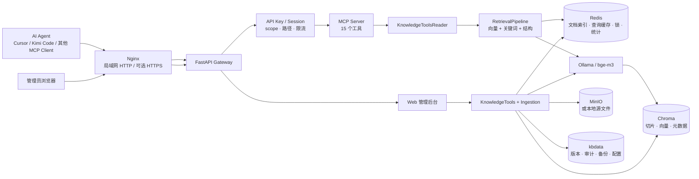
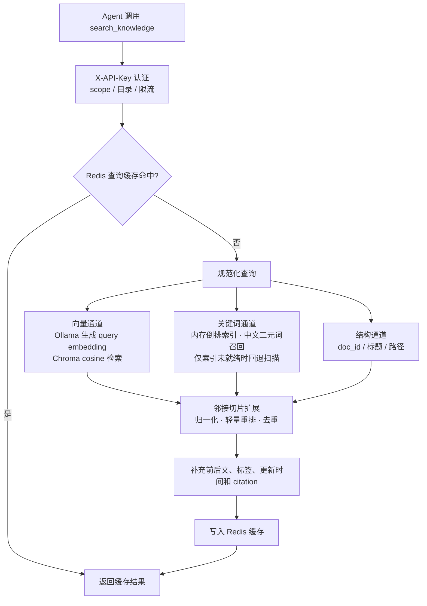

# Knowledge Base Management

面向内部局域网的知识库 Demo：管理员通过 Web 后台维护 Markdown 文档，AI Agent 通过 MCP 检索知识库，并基于返回的片段、上下文和引用自行组织答案。

> 当前定位是“可运行、可验证的内网 Demo”，不是完整的企业知识平台。核心目标是验证 `Agent → MCP → 混合检索 → 文档证据` 这条链路；公网暴露、租户隔离、合规与纵深安全暂不作为本阶段重点。

## 项目能做什么

- 通过 MCP Streamable HTTP（`/mcp`）向 Agent 暴露检索与文档管理工具。
- 使用向量、关键词和标题/路径结构三路召回，而不是只做向量搜索。
- 返回切片内容、相邻上下文、文档路径、标签和可引用定位，便于 Agent 给出有依据的回答。
- 通过 Web 后台上传、编辑、删除、重建索引和管理目录。
- 使用 API Key 控制 Agent 的 `read` / `write` scope、有效期、限流和可访问目录。
- 支持文档版本、恢复、写入前相似文档检查、upsert、审计日志和知识图谱。
- 支持备份/恢复、Redis–Chroma–源文件一致性检查和重索引任务。
- Docker Compose 一体化部署；Windows 也可使用本地启动脚本和桌面壳。

本项目不负责调用大模型生成最终回答，也不保存对话。Agent 调用 `search_knowledge` / `get_document` 获得证据后，自行完成总结、引用和推理。

## 当前架构



### MCP 检索链路



默认查询缓存 TTL 为 300 秒。三条检索通道并发执行并各自受超时保护，单通道故障会记录在 `retrieval_errors` 中而不阻断其他结果；相邻上下文补充超时也会保留已经召回的切片。整个检索默认最多等待 8 秒，同时最多处理 8 个检索请求，排队超过 250 毫秒会返回带 `retry_after_ms` 的繁忙错误。

服务启动时会构建完整的内存关键词倒排索引。索引就绪后，即使关键词零命中也会直接返回空结果，不再逐篇读取全库切片；只有启动期间索引尚未就绪时，关键词通道才使用切片扫描作为可用性兜底。结构通道仍会轻量遍历 Redis 中的文档摘要，以匹配 `doc_id`、标题和路径，但不会因此读取每篇正文。新增、更新、删除和单文档重索引会增量维护关键词索引，目录批量移动使用全量重建兜底，所有写操作都会使旧查询缓存失效。中文连续文本会同时生成二元词片，因此查询和文档不必按空格分词也能产生关键词交集。

## 快速开始：Docker 局域网部署

### 环境要求

- Windows 使用已启动的 Docker Desktop；Linux/macOS/WSL 使用 Docker Engine 或 Docker Desktop。
- Docker Compose v2，即 `docker compose` 命令。
- 建议 8 GB 以上内存。CPU 可以运行，NVIDIA GPU 可自动检测或手动指定。
- 首次启动会下载镜像和约 1 GB 的 `bge-m3` 模型，需要能够访问对应镜像源。

### 一条命令启动

克隆仓库并进入项目目录后执行对应入口；无需手动复制 `.env`、生成密钥或拉取模型。

Windows Docker Desktop：

```powershell
.\start.ps1 up
# 也可以双击 start-docker.bat
```

Linux / macOS / WSL：

```bash
sh ./start.sh up
# 已安装 make 时也可执行 make up
```

启动器会依次完成：

1. 从 `.env.example` 创建 `.env`，替换模板中的 `SESSION_SECRET` 和 MinIO 密码占位值；其他已有配置不会被覆盖。
2. 检查 Docker、Compose 和 daemon，自动选择 CPU 或 NVIDIA GPU 配置。
3. 构建并启动依赖；等待 Ollama 健康后，由一次性初始化容器自动拉取 `OLLAMA_MODEL`（默认 `bge-m3`）。
4. 等待 Gateway 健康检查通过再报告完成；等待期间每 30 秒显示一次进度，超时会自动打印关键容器状态和日志。

首次自动创建的配置适合直接在本机或可信局域网试用，后台初始账号为 `admin` / `123456`。需要自定义内网域名、管理员密码、数据目录或国内镜像时，先初始化再编辑：

```powershell
# Windows
.\start.ps1 init
notepad .env
.\start.ps1 up
```

```bash
# Linux / macOS / WSL
sh ./start.sh init
${EDITOR:-vi} .env
sh ./start.sh up
```

纯内网通常保持 `EXTERNAL_DOMAIN=`，`INTERNAL_DOMAIN` 可填写主机名、内网域名或服务器 IP。直接通过 IP 访问时，Nginx 的 default server 也会接收请求。CPU-only 机器可将 `OLLAMA_NUM_PARALLEL` 调为 `1`。

### 常用部署命令

| 操作 | Windows | Linux / macOS / WSL |
|---|---|---|
| 启动并等待就绪 | `.\start.ps1 up` | `sh ./start.sh up` |
| 查看状态与健康 | `.\start.ps1 status` | `sh ./start.sh status` |
| 跟踪全部日志 | `.\start.ps1 logs` | `sh ./start.sh logs` |
| 停止服务 | `.\start.ps1 down` | `sh ./start.sh down` |
| 只初始化配置 | `.\start.ps1 init` | `sh ./start.sh init` |
| 强制 CPU | `.\start.ps1 up -Gpu cpu` | `sh ./start.sh up --cpu` |
| 强制 NVIDIA GPU | `.\start.ps1 up -Gpu gpu` | `sh ./start.sh up --gpu` |

`status` 会同时显示 Compose 容器状态并请求 Gateway `/health`。启动阻塞时终端会持续给出等待进度；另一个终端可以运行 `logs` 查看模型下载、依赖健康检查和 Gateway 启动日志。

### 访问地址

Docker 默认把 Gateway、Chroma、Redis、MinIO、Ollama 的宿主机端口绑定到 `127.0.0.1`，只把 Nginx 的 `80/443` 暴露给局域网。因此局域网客户端应使用：

| 用途 | 局域网地址 |
|---|---|
| 管理后台 | `http://<服务器IP>/admin` |
| MCP Streamable HTTP | `http://<服务器IP>/mcp` |
| MCP SSE 兼容端点 | `http://<服务器IP>/sse` |
| 健康检查 | `http://<服务器IP>/health` |
| 运行指标 | `http://<服务器IP>/metrics` |

`http://127.0.0.1:8000/*` 是服务器本机直连 Gateway 的地址，不是 Docker 局域网接入地址。

### 初始化知识库和 API Key

1. 打开 `http://<服务器IP>/admin`。
2. 首次启动且账号文件为空时，系统会用 `ADMIN_INITIAL_USERNAME` / `ADMIN_INITIAL_PASSWORD` 创建 `super_admin`。
3. 在后台上传或新建 Markdown 文档。
4. 在“API Key”页面创建 Agent 使用的 Key；完整 Key 只展示一次。
5. 只检索时勾选 `read`。如需同一个 Agent 同时检索和写入，必须同时勾选 `read` 与 `write`；两个 scope 相互独立。

如果 Key 使用受限目录模式，Agent 应在搜索和列举时显式传入允许的 `filter_path` / `path`。

## Windows 原生开发模式（不使用 Docker）

日常部署优先使用上面的 Docker 入口。确实需要调试 Python 源码时，Windows 原生模式要求 Python 3.11+、Ollama 和 Redis/Memurai；脚本会管理 Chroma、MinIO 和 Gateway：

```powershell
.\start-dev.ps1
# 或双击 start-dev.bat
```

首次运行会自动创建独立的 `.env.local`、按缺失情况安装 Python 依赖、启动或复用本机服务，并在缺少时拉取 `bge-m3`。后续启动会跳过已满足的 pip 安装，因此不会每次重复下载依赖。

```powershell
# 修改本地配置
notepad .env.local

# 强制重新检查并安装 requirements.txt
.\start-dev.ps1 -Install

# 只停止本项目占用 8000/8001/9000/9001 的 Gateway、Chroma、MinIO
.\start-dev.ps1 -Stop
```

`-Stop` 不再终止机器上共享的所有 Python、Ollama 或 Redis/Memurai 进程。若服务缺失或启动失败，脚本会立即给出具体依赖，不会继续显示“全部就绪”。`init-config.bat` 现在只用于初始化 Docker 的 `.env`，不用于原生开发模式。

也可以使用桌面入口：

```powershell
.\start-desktop-shell.bat
# 旧版 tkinter 启动器
.\start-gui.bat
```

本地模式默认按 `.env.local` 的 `BIND_HOST=0.0.0.0` 监听 `http://<主机>:8000`。仅需本机访问时改为 `127.0.0.1`；允许局域网访问时还需配置 Windows 防火墙。

## 连接 MCP

### 推荐：Streamable HTTP

在支持远程 MCP 的客户端中加入：

```json
{
  "mcpServers": {
    "knowledge-base": {
      "url": "http://192.168.1.100/mcp",
      "headers": {
        "X-API-Key": "sk-your-api-key"
      }
    }
  }
}
```

本地原生运行时可改为 `http://192.168.1.100:8000/mcp`。客户端配置格式会随产品版本变化，请以客户端当前支持的远程 MCP 配置为准；关键是 URL 和 `X-API-Key` Header。

### 兼容端点：SSE

旧客户端可以连接 `/sse`，消息端点由服务端协商为 `/sse/messages/`。如果客户端只支持 stdio，可在客户端侧使用 MCP HTTP/SSE 到 stdio 的代理。优先使用 Header 传 Key，避免把 Key 放进 URL、日志和历史记录。

## Agent 推荐调用方式

一个稳妥的只读流程是：

1. 不清楚知识结构时，先调用 `list_directories` 或 `list_documents`。
2. 调用 `search_knowledge`，使用完整、具体的问题，通常先取 `top_k=5`。
3. 优先使用结果中的 `content`、`context_before`、`context_after` 和 `citation` 回答。
4. 只有确实需要全文时才调用 `get_document`，避免把长文档全部塞入 Agent 上下文。
5. 结果不足时换一种问法，或通过 `filter_path` / `filter_tags` 缩小范围再次检索。

示例参数：

```json
{
  "query": "生产环境发布失败后应该如何回滚，执行顺序和检查点是什么？",
  "top_k": 5,
  "filter_path": "运维/发布",
  "filter_tags": ["生产", "回滚"],
  "include_context": true,
  "max_context_chars": 1200
}
```

当前 `filter_path` 是精确目录匹配，不会自动包含子目录。`max_context_chars` 限制每条结果的前后相邻上下文总字符数；设 `include_context=false` 可跳过相邻切片读取，适合先低成本筛选再按 `doc_id` 精读。`score` 是多通道归一化后的相对排序分数，不应当作严格概率或事实置信度。

`search_knowledge` 的主要返回字段：

| 字段 | 含义 |
|---|---|
| `content` | 命中的切片正文 |
| `context_before` / `context_after` | 同一文档的相邻切片 |
| `context_truncated` | 相邻上下文是否因字符预算被截断 |
| `title` / `path` / `doc_id` | 来源文档定位 |
| `chunk_index` / `total_chunks` | 切片位置 |
| `citation` | 形如 `目录:标题#chunk-N` 的引用标识 |
| `channel` | `vector`、`keyword`、`structure` 或邻接扩展通道 |
| `score` / `raw_score` / `final_score` | 排序与调试分数 |
| `tags` / `updated_at` | 文档标签和更新时间 |
| `retrieval_errors` | 某一检索通道失败时的降级信息 |
| `cache_hit` | 是否命中 Redis 查询缓存 |
| `status` / `timed_out` | `ok` 或 `degraded`，以及本次是否发生阶段/总超时 |
| `timings_ms` | 检索、上下文补充和总耗时（毫秒） |

## MCP 工具

### 只读工具

| 工具 | 说明 | 主要参数 | Scope |
|---|---|---|---|
| `search_knowledge` | 混合检索并返回切片、可控上下文和引用 | `query`; 可选 `top_k`, `filter_tags`, `filter_path`, `include_context`, `max_context_chars` | `read` |
| `get_document` | 获取文档源内容、元数据和全部切片 | `doc_id` | `read` |
| `list_documents` | 按精确目录/标签分页列出文档 | 可选 `path`, `tags`, `limit`, `offset` | `read` |
| `list_directories` | 返回目录树 | 无 | `read` |
| `list_document_versions` | 列出文档版本快照（不含快照正文） | `doc_id` | `read` |
| `find_similar_documents` | 写入前检查同标题、同内容或近似文档 | `title`, `content`; 可选 `path`, `top_k` | `read` |

### 写入与维护工具

| 工具 | 说明 | 主要参数 | Scope |
|---|---|---|---|
| `add_document` | 新增 Markdown 文档并切片、向量化 | `title`, `content`; 可选 `path`, `tags` | `write` |
| `update_document` | 覆盖更新文档，写入前保存版本 | `doc_id`, `title`, `content`; 可选 `path`, `tags` | `write` |
| `upsert_document` | 按标题路径、内容哈希或近似度创建/更新 | `title`, `content`; 可选 `match_strategy`, `on_conflict` 等 | `write` |
| `delete_document` | 删除源文件、切片和文档索引 | `doc_id` | `write` |
| `rename_directory` | 重命名目录并移动子目录文档 | `old_path`, `new_path` | `write` |
| `delete_directory` | 删除目录并把其中的文档移到根目录 | `path` | `write` |
| `reindex_document` | 使用当前切片和 Embedding 配置重建单篇文档 | `doc_id` | `write` |
| `restore_document_version` | 恢复指定版本 | `doc_id`, `version_id` | `write` |
| `build_knowledge_graph` | 生成标签、目录和可选语义关系图 | 可选 `semantic_threshold` | `write` |

MCP 工具调用仍是请求—响应模式，调用方会等待最终结果。客户端在请求中提供 `progressToken` 且支持展示 MCP progress notification 时，`add_document`、`update_document` 和 `reindex_document` 会发送 0–100 的阶段提示，例如“生成向量”“等待写入锁”“替换文档索引”；不支持进度通知的客户端只会表现为普通等待。检索不发送进度流，但有总时限、阶段时限和并发排队上限；超时会返回 `degraded` 信息，过载会快速返回 `503` 和建议重试时间。

写入使用 Redis 分布式锁串行提交，Embedding 会尽量在进入锁之前完成，持锁期间会周期性续租。锁被占用时返回 `423`，错误详情包含 `retry_after_ms`，调用方可据此延迟重试。`update_document` 是覆盖式更新；请显式提供需要保留的标签。

## 文档入库链路

新增文档会经过以下节点：

1. 校验标题和 Markdown 内容。
2. 统一换行、规范目录和标签。
3. 按 Markdown 标题/段落切片。
4. 使用 Ollama 批量生成 Embedding；可按配置切换到备用 Ollama Provider。
5. 获取写锁后保存 Markdown 源文件。
6. 把切片、Embedding 和元数据写入 Chroma。
7. 把文档摘要和内容哈希写入 Redis 文档索引。
8. 增量更新该文档的关键词索引并使查询缓存失效。

更新和重索引会先写 staging 数据，提交失败时尽量恢复旧切片；更新、删除和恢复前会写入文档版本快照。

> 有标题和自然段的 Markdown 能提供更好的检索上下文。完全不换行的超长段落会按 `CHUNK_SIZE` / `CHUNK_OVERLAP` 滑动切片，不会截断尾部内容。

## 存储职责

| 存储 | 保存内容 | 是否可重建 |
|---|---|---|
| Chroma | 文档切片、Embedding、检索元数据 | 可由 Markdown 源文件重新入库/重索引 |
| MinIO | 原始 Markdown 源文件 | 主要事实来源之一，需要备份 |
| 本地文件存储 | MinIO 不可用时的源文件 Adapter | 需要备份 |
| Redis | API Key 运行态、文档摘要索引、查询缓存、统计、限流、写锁 | 文档摘要索引会在启动时与 Chroma 对账；其他部分可由配置文件恢复或作为缓存丢弃 |
| `kbdata/config` | 账号、API Key 持久化、目录、审计日志、运行配置 | 需要备份 |
| `kbdata/versions` | 文档历史快照 | 需要备份 |
| `kbdata/backups` | 后台创建的备份包和索引 | 备份输出 |
| `kbdata/graph` | 知识图谱 JSON/HTML | 可重新生成 |

系统提供一致性检查，用于发现 Redis 文档索引、Chroma 切片和源文件之间的缺失、孤儿数据或数量不一致：

```bash
# Docker
docker compose exec mcp-gateway python src/consistency_cli.py

# 本地
cd mcp-gateway
python src/consistency_cli.py
```

## 主要配置

完整的常用示例见 `.env.example`（Docker）和 `.env.example.local`（Windows 本地）。

| 配置 | 默认/示例 | 说明 |
|---|---|---|
| `HOST_KBDATA_DIR` | `./kbdata` | Docker 宿主机数据目录 |
| `KBDATA_DIR` | Docker 内固定 `/app/data` | 本地运行时的数据根目录 |
| `SESSION_SECRET` | 无有效默认值 | `DEBUG=false` 时必须至少 32 字符 |
| `ADMIN_INITIAL_USERNAME` | `admin` | 账号文件为空时创建的超级管理员 |
| `ADMIN_INITIAL_PASSWORD` | `123456` | 仅初始化时使用，Demo 也建议修改 |
| `REDIS_URL` | `redis://localhost:6379/0` | Docker Compose 会覆盖为 `redis` |
| `CHROMA_HOST` / `CHROMA_PORT` | `localhost` / `8001` | Docker 内部覆盖为 `chroma:8000` |
| `CHROMA_COLLECTION` | `knowledge_base_management` | Chroma collection 名称 |
| `OLLAMA_URL` / `OLLAMA_MODEL` | `http://localhost:11434` / `bge-m3` | 主 Embedding Provider |
| `EMBEDDING_FALLBACKS` | 空 | `url|model,url|model` 格式的备用 Ollama Provider |
| `SEARCH_CACHE_TTL` | `300` | 查询结果缓存秒数；设为 `0` 关闭 |
| `SEARCH_TOTAL_TIMEOUT_MS` | `8000` | 单次检索请求总时限；超时返回降级结果 |
| `SEARCH_ENRICH_TIMEOUT_MS` | `1500` | 标签、引用和相邻上下文补充阶段时限 |
| `SEARCH_MAX_CONCURRENCY` | `8` | 同一 Gateway 进程并发执行的检索上限 |
| `SEARCH_QUEUE_TIMEOUT_MS` | `250` | 等待检索并发槽位的最长时间，超出返回繁忙错误 |
| `SEARCH_CONTEXT_MAX_CHARS` | `2000` | 未显式传参时，每条检索结果的相邻上下文总字符预算 |
| `CHUNK_SIZE` / `CHUNK_OVERLAP` | `512` / `50` | Markdown 切片参数，单位为字符 |
| `WRITE_LOCK_TTL` | `30` | Redis 写锁过期秒数 |
| `RATE_LIMIT_DEFAULT` | `30` | API Key 每分钟默认 HTTP 请求数 |
| `MINIO_ENDPOINT` / `MINIO_BUCKET` | `localhost:9000` / `kb-sources` | 源文件对象存储 |
| `EXTERNAL_DOMAIN` | 可为空 | 外网/HTTPS 入口；纯内网 Demo 留空 |
| `INTERNAL_DOMAIN` | `localhost` 或内网域名 | Nginx 内网 server name |
| `CORS_ORIGINS` | `*` | Demo 可用；对外部署时应收紧 |

Embedding Provider 还支持健康检查缓存、失败阈值和熔断冷却：`EMBEDDING_HEALTH_CACHE_TTL`、`EMBEDDING_FAILURE_THRESHOLD`、`EMBEDDING_CIRCUIT_COOLDOWN`。

## Web 后台

后台当前包含：

- 文档列表、全文查看、Markdown 编辑、下载、批量上传和压缩包导入。
- 目录、标签、用户角色和路径权限管理。
- API Key 创建、吊销、删除和使用统计。
- 文档版本与恢复、入库/清理/重索引任务。
- 知识图谱生成与查看。
- 备份策略、备份创建、下载、恢复和一致性维护。
- 审计日志、运行健康、DDNS、反向代理和环境配置页面。

Web 角色为 `super_admin`、`admin`、`user`（可编辑授权目录）和 `viewer`（只读授权目录）。API Key scope 与 Web 角色是两套独立机制。

## 备份与恢复

推荐通过后台维护页面创建和恢复备份。也可以导出 Markdown 源文件：

```bash
docker compose exec mcp-gateway python src/backup_sources.py -o /app/data/backups
```

最重要的数据是 Markdown 源文件、`kbdata/config` 和 `kbdata/versions`。只备份 Chroma 不能完整恢复账号、API Key、源文档和版本历史。

## 测试

```powershell
python -m pip install -r mcp-gateway/requirements-dev.txt
python -m pytest -q
python scripts/check_deps_sync.py
```

Linux / CI：

```bash
python -m pip install -r mcp-gateway/requirements-dev.txt
python -m pytest -q
python scripts/check_deps_sync.py
```

根目录的 `pytest.ini` 已将标准测试限定到 `mcp-gateway/tests`；`scripts/test.ps1` / `scripts/test.sh` 是等价的跨平台包装。`tests/test_launcher.py` 和 `tests/process_test.py` 是独立诊断脚本，后者可能启动或终止本机 Gateway 进程，请按需单独执行。

## 目录结构

```text
knowledge-base-management/
├── docker-compose.yml              # Nginx、Gateway、Redis、Chroma、MinIO、Ollama
├── docker-compose.gpu.yml          # NVIDIA GPU 覆盖配置
├── .env.example                    # Docker 配置模板
├── .env.example.local              # Windows 本地配置模板
├── start.sh / start.ps1            # Linux/Windows Docker 统一部署入口
├── start-docker.bat / Makefile     # Docker 双击入口与命令包装
├── start-dev.ps1                   # Windows 原生开发服务编排
├── start-desktop-shell.bat         # Windows 桌面壳入口
├── mcp-gateway/
│   ├── requirements.txt
│   ├── requirements-dev.txt
│   ├── src/
│   │   ├── main.py                 # FastAPI 组合根、lifespan、MCP transport
│   │   ├── server.py               # MCP 工具 schema、scope/path guard、dispatch
│   │   ├── tools_reader.py         # 只读工具、查询缓存、结果增强
│   │   ├── tools.py                # 写工具、版本、upsert、staging/恢复
│   │   ├── rag/
│   │   │   ├── retrieval.py        # 三路召回、邻接扩展、归一化与重排
│   │   │   └── keyword_index.py    # 内存关键词倒排索引
│   │   ├── ingestion.py            # 文档入库节点 Pipeline
│   │   ├── knowledge_base.py       # Chroma + Redis 文档索引 Adapter
│   │   ├── embedding.py            # Ollama Provider、fallback 与熔断
│   │   ├── chunker.py              # Markdown 标题/段落切片
│   │   ├── source_store.py         # MinIO 源文件 Adapter
│   │   ├── local_store.py          # 本地源文件 Adapter
│   │   ├── auth.py                 # Agent API Key
│   │   ├── admin_auth.py           # Web Session 与账号
│   │   ├── backup_manager.py       # 备份、恢复、计划任务
│   │   ├── consistency.py          # 三存储一致性检查
│   │   └── admin/                   # 后台路由与 Jinja2 模板
│   └── tests/                       # Gateway 单元/集成风格测试
├── kbdata/                          # 默认运行时数据根目录
├── nginx/                           # 动态 Nginx 配置生成
├── scripts/                         # 测试与依赖一致性脚本
├── 用户接入指南.md
└── Agent 使用指南.md
```

## 当前阶段限制

- 以 Markdown 文档和单一共享知识库为主，没有多租户知识空间。
- 检索是本地混合召回和启发式重排，没有 Cross-Encoder 或 LLM reranker。
- 路径筛选为精确目录；递归目录搜索需要 Agent 分目录调用或后续扩展。
- 写入提交被全局锁串行化，适合 Demo 的低写入量，不适合高并发采集。
- `get_document` 返回全文和全部切片，超长文档可能占用较多 Agent 上下文。
- Redis 是 MCP 认证、限流、文档摘要索引和缓存的关键依赖。
- 本阶段面向可信局域网。若要公网或生产使用，应另行完成安全、观测、容量和灾备评审。

## 技术版本

| 模块 | 当前版本/镜像 |
|---|---|
| Python | 3.11+；CI 使用 3.13 |
| FastAPI / Starlette | 0.135.3 / 1.0.0 |
| MCP Python SDK | 1.16.0 |
| Chroma | 1.5.9 |
| Ollama | 0.6.0，默认模型 `bge-m3` |
| Redis | 7-alpine |
| MinIO | `RELEASE.2025-01-20T14-49-07Z` |
| Nginx | 1.27-alpine |

## License

当前仓库未包含独立的 `LICENSE` 文件；如需对外分发，请先补充明确的许可声明。
